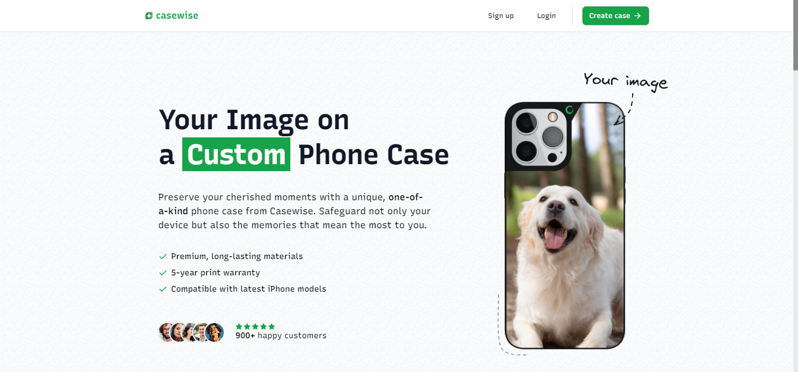

# Casewise

Casewise is your go-to destination for high-quality, personalized phone cases that capture your most cherished memories. This platform allows customers to design custom phone cases, combining style and protection in one unique product. If you want to preserve a special moment or want a case that reflects your style, make a purchase now!

## Screenshot



<p align="center">
  <a href="https://casewise.nabarun.app"><strong>View Project »</strong></a>
</p>

## Running Locally

This application requires Node.js v20.14.0+.

### Cloning the repository to the local machine:

```bash
git clone https://github.com/nabarvn/casewise.git
cd casewise
```

### Installing the dependencies:

```bash
pnpm install
```

### Setting up the `.env` file:

```bash
cp .env.example .env
```

> [!IMPORTANT]
> Ensure you populate the variables with your respective API keys and configuration values before proceeding.

### Configuring Prisma:

```bash
pnpm prisma generate
```

```bash
pnpm prisma db push
```

### Running the application:

```bash
pnpm dev
```

## Tech Stack

- **Language**: [TypeScript](https://www.typescriptlang.org)
- **Framework**: [Next.js](https://nextjs.org)
- **Styling**: [Tailwind CSS](https://tailwindcss.com)
- **Analytics**: [Vercel Analytics](https://vercel.com/analytics)
- **State Management**: [React Query](https://www.npmjs.com/package/@tanstack/react-query)
- **Postgres Database**: [Neon](https://neon.tech/docs/introduction/about)
- **ORM Toolkit**: [Prisma](https://www.prisma.io/docs/concepts/overview/what-is-prisma)
- **Email API**: [Resend](https://resend.com/docs/send-with-nextjs)
- **Authentication**: [Clerk](https://clerk.com/docs/quickstarts/nextjs)
- **File Hosting**: [UploadThing](https://docs.uploadthing.com)
- **Payments**: [Stripe](https://stripe.com/docs/payments)
- **Deployment**: [Vercel](https://vercel.com)

## Acknowledgements

- **Custom UI Components**: [shadcn/ui](https://ui.shadcn.com/docs)
- **Auth Component Library**: [Clerk Elements](https://clerk.com/docs/customization/elements/overview)

## Credits

Learned a ton while building this project. Major thanks to Josh for the next level (no pun intended) tutorial!

<hr />

<div align="center">Don't forget to leave a STAR 🌟</div>
